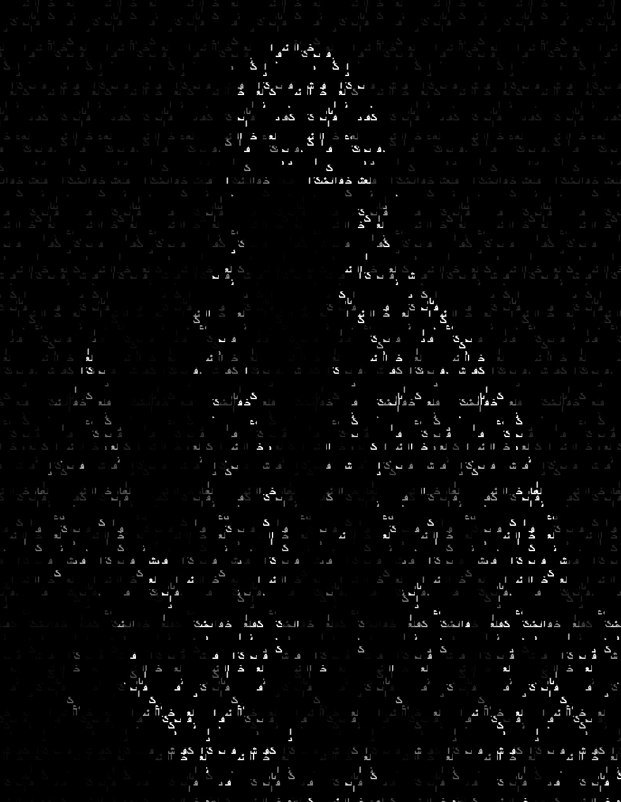
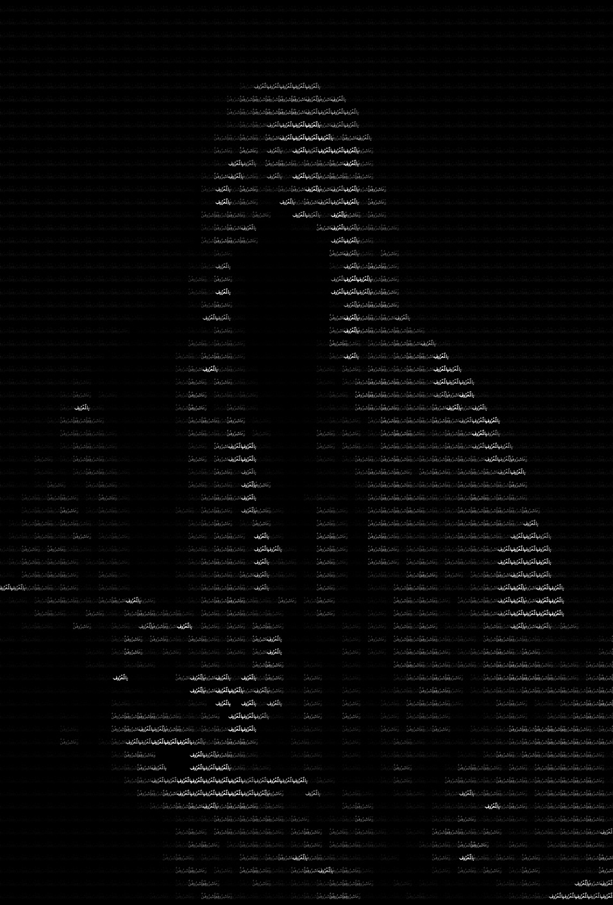
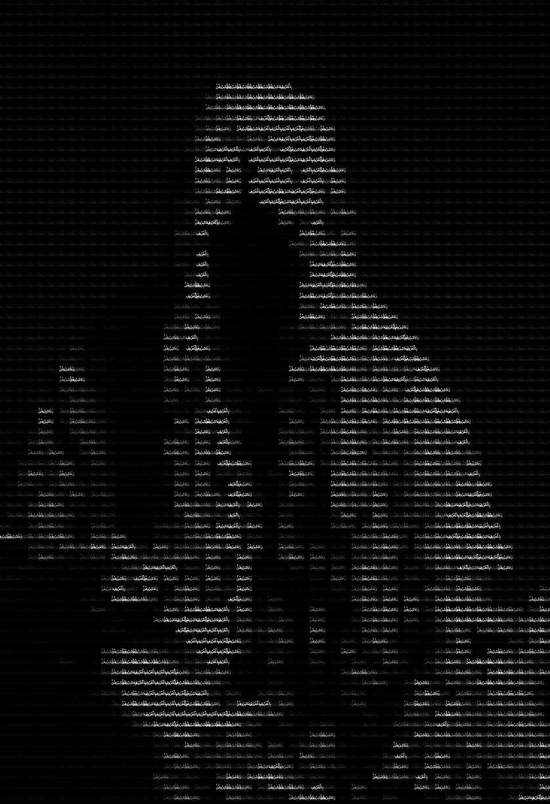

<h1>Sketch Js - ASCII Image</h1>

<h2>Final Image</h2>
      

  

[Click here to view Sketch](https://editor.p5js.org/Nkanziii/full/vuB0vcSnQ)

[Click here to view code](assets/code/ascii-images.js)

 ---
 
 <h2>Initial Image</h2>
 

  
  

[Click here to view sketch](https://editor.p5js.org/Nkanziii/full/MOR1kkQHd)

[Click here to view code](assets/code/initial-ascii.js)
